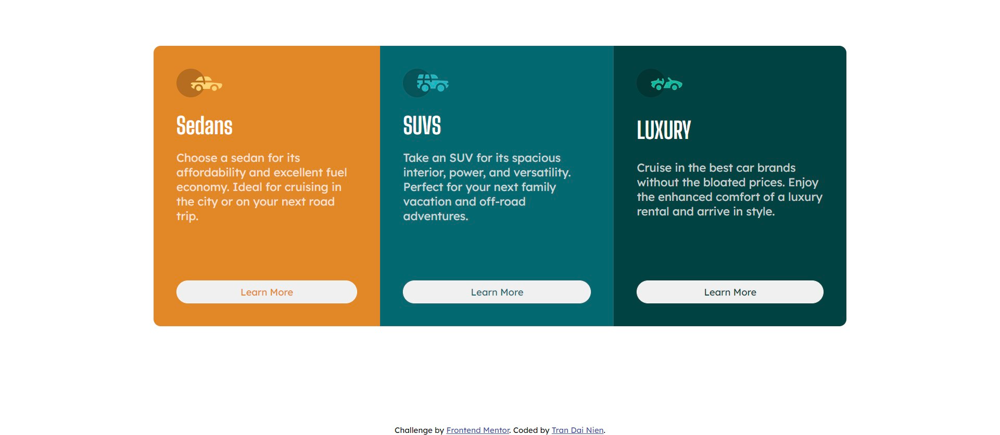

# Frontend Mentor - 3-column preview card component solution

This is a solution to the [3-column preview card component challenge on Frontend Mentor](https://www.frontendmentor.io/challenges/3column-preview-card-component-pH92eAR2-). Frontend Mentor challenges help you improve your coding skills by building realistic projects. 

## Table of contents

- [Overview](#overview)
  - [The challenge](#the-challenge)
  - [Screenshot](#screenshot)
  - [Links](#links)
- [My process](#my-process)
  - [Built with](#built-with)
  - [What I learned](#what-i-learned)
  - [Useful resources](#useful-resources)

## Overview

### The challenge

Users should be able to:

- View the optimal layout depending on their device's screen size
- See hover states for interactive elements

### Screenshot

### Links

- Solution URL: [Add solution URL here](https://github.com/NienDev/3-column-preview-card.git)
- Live Site URL: [Add live site URL here](https://niendev.github.io/3-column-preview-card/)

## My process

### Built with

- HTML
- CSS

**Note: These are just examples. Delete this note and replace the list above with your own choices**

### What I learned

- Using Flex Properties to make the elements in row or in column. 

### Useful resources

- [3-Column Preview Card Component | Frontend Mentor Challenge | Day 3](https://www.youtube.com/watch?v=5DAvEEKfTEE&list=PLcZZlEf3w738Bv45a8yI_iIv2OGx_JLvz&index=3) - This is a solution of this problem. I use it when i finish the project to see there is something to improve in my code compare to the tutorial code.

